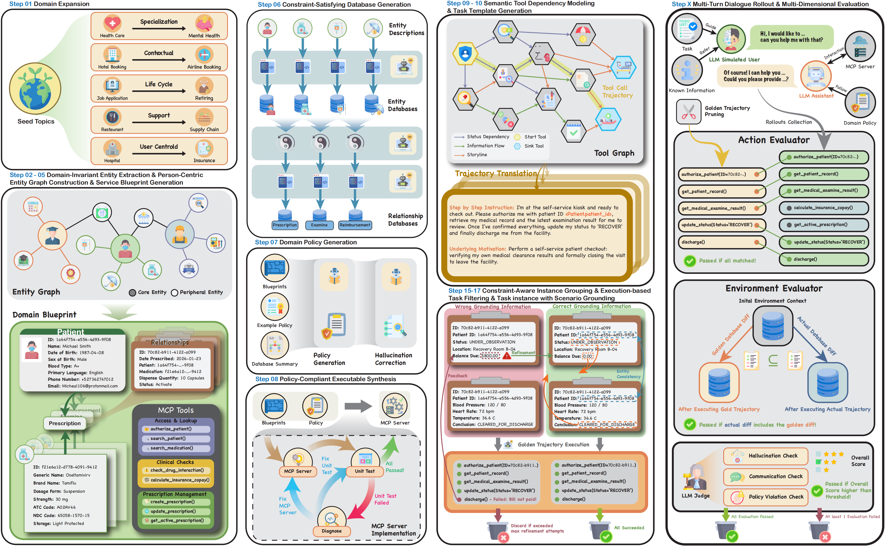
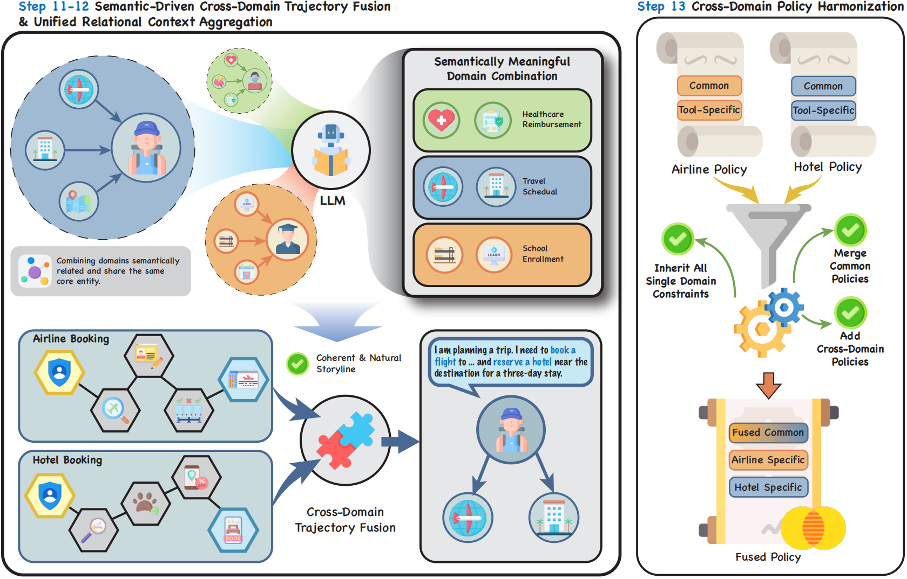
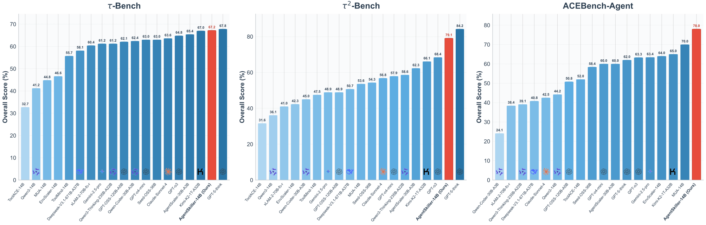

<div align="center">
  
</div>
<hr>
<div align="center" style="line-height: 1;">
  <a href="https://huggingface.co/AgentSkiller/datasets"></a>
  <a href="https://huggingface.co/AgentSkiller/models"></a>
  <a href="">
    
  </a>
  <a href="http://arxiv.org/abs/2602.09372"></a>
</div>

<div align="center">
  <a href="README_zh.md">中文</a> | <a href="README.md">English</a>
</div>

<h5 align="center"> 如果你喜欢我们的项目，请在 GitHub 上给我们一个 star ⭐。非常感谢你的支持。</h5>

## 1. 介绍



AgentSkiller 是一个强大的框架，旨在为下一代通用智能体合成复杂、高质量的训练数据。与以往的特殊方法不同，AgentSkiller 采用由有向无环图（DAG）编排的状态机驱动架构，确保确定性、可恢复性和可执行性。

该框架生成具有确定性状态转换的连贯环境，通过严格的流水线系统地扩展函数调用场景的空间——从建立以实体为中心的实体图和标准化模型上下文协议（MCP）蓝图，到利用基于人格的模拟器进行自然语言生成。

### 🏗️ 稳健的架构

AgentSkiller 基于三个核心设计原则，确保基础环境的质量：

- 🧠 双模型架构：将语义推理与语法实现解耦，确保高质量的代码生成。

- ⚙️ 细粒度编排：为长时间运行生成任务提供自动检查点功能。

- 🛠️ 测试驱动自我纠正：一种迭代机制，自动检测并纠正生成代码中的错误以确保可执行性。

## 2. 跨域任务生成



虽然许多现有框架专注于原子性的单域任务，但 AgentSkiller 通过自动化跨域互操作性的合成，开创了新局面。现实世界的任务通常跨越多个服务边界（例如，预约医疗预约并立即提交保险索赔）。AgentSkiller 引入了专门的语义驱动跨域融合阶段来模拟这些高保真场景：

### ⛓️ 轨迹联锁与策略调和

与简单的拼接不同，我们的系统执行深度语义融合：

- **语义链接**：我们通过共享核心实体链接不同的工作流程（例如，航空公司和酒店），合成需要多跳推理的连贯故事情节。

- **统一治理**：基于 LLM 的调解器解决域间冲突规则（例如，隐私与数据共享），并合成"桥接规则"来管理服务之间的接口。

### 🔍 命名空间隔离的上下文

为了支持执行，我们实现了数据库融合模块，在防止模式冲突的同时聚合实体。通过执行命名空间隔离策略，关系保持其域特定性（例如，`Hospital_Patient` 与 `Insurance_Client`），允许系统无歧义地验证约束。

### ✅ 可行性感知效率

为了处理域对组合的爆炸性增长，我们采用单域可行性过滤。如果任务段在单个域中无效，系统会预先剪除跨域轨迹，确保计算资源仅集中在可行的、有价值的组合上。

## 3. 主要结果对比



为了严格验证所提出框架的实用性，我们使用 AgentSkiller 合成了约 11k 多轮交互轨迹的语料库。随后在具有挑战性的函数调用基准测试（包括 $\tau$-bench、$\tau^2$-bench 和 ACEBench）上进行的实验表明，在此数据集上训练的模型能带来显著的性能提升。值得注意的是，AgentSkiller-14B 在复杂的工具使用场景中表现出色，始终优于已建立的开源基线，并与最先进的专有模型达到同等水平。

## 4. 数据集和模型

| 名称 | 链接 |
| -------- | ----------- |
| AgentSkiller-11K | [🤗Hugging Face Dataset](https://huggingface.co/datasets/AgentSkiller/AgentSkiller-11K) |
| AgentSkiller-4B | [🤗Hugging Face Models](https://huggingface.co/AgentSkiller/AgentSkiller-4B) |
| AgentSkiller-8B | [🤗Hugging Face Models](https://huggingface.co/AgentSkiller/AgentSkiller-8B) |
| AgentSkiller-14B | [🤗Hugging Face Models](https://huggingface.co/AgentSkiller/AgentSkiller-14B) |


## ⚙️ 安装

```bash
conda create -n agentSkiller python=3.11
pip install -r requirements.txt
```

## 🚀 快速开始

### 1）合成任务/查询（Agent Skiller）

```bash
python -m agentskiller run --config config.yaml
```

会在 `outputs/` 下生成评测所需产物（queries、生成的 MCP server、数据库等）。

### 2）采集 rollouts

采集模块有独立依赖与入口，见：

- `rollout/README_zh.md`
- `rollout/README.md`

### 3）评测 rollouts

```bash
python -m evaluator.run_evaluation --mode all \
  --rollouts-dir rollouts/ \
  --outputs-dir outputs/ \
  --mcp-outputs-dir outputs/ \
  --output outputs/evaluation/results.jsonl
```

## 👀 AgentSkiller 流程总览

* **单域（Single Domain）**：Step `01` – `09` & Step `14` – `17`
* **跨域（Cross Domain）**：Step `01` – `09` & Step `10` – `13` & Step `14` – `17`

### 每步做什么（速查表）
|Step|名称|作用|主要产物（默认在 `outputs/`）|备注|
|-|-|-|-|-|
|s01|domain_expansion|扩展 seed domains|`domain_topics.json`||
|s02|entity_extraction|抽取实体|`entities.json`||
|s03|entity_graph|构建实体图|`entity_graph.json`||
|s04|blueprint_generation|生成 MCP 蓝图|`blueprints.json`||
|s05|tool_list_formulation|修复蓝图并导出 tool lists|`blueprints.json`,  `tool_lists/*.json`||
|s06|database_generation|生成实体/关系数据库与摘要|`database/`,  `database_summary/`|代码生成 + 执行|
|s07|policy_generation|生成 domain policy|`policies/*.md`|含结构化 markers（供过滤）|
|s08|tool_graph_generation|生成工具依赖图|`tool_graphs/*.json`||
|s09|mcp_server_implementation|实现 MCP server + tests|`mcp_servers/*.py`||
|s10|domain_combos_selection|选跨域组合|`cross_domain_templates/_combinations.json`|**跨域专用**|
|s11|trajectory_fusion|跨域轨迹融合|`cross_domain_templates/*.json`|**跨域专用**|
|s12|database_fusion|跨域数据库融合|`database/outputs/relationships/{fused}/*.json` `database/outputs/entities/{fused}/*.json`|**跨域专用**|
|s13|policy_merge|跨域 policy 合并|`policies/{fused}.md`|**跨域专用**|
|s14|task_template_generation|生成 task templates|`task_templates/*.json`||
|s15|instance_combos_selection|为模板选择/生成实例组合|`combinations/**`或 `validated_tasks/**`|单域 Sampling；跨域 Creation-Validation|
|s16|task_filtering|执行轨迹验证过滤|`validated_tasks/**`|只有Single Domain需要|
|s17|task_instantiation|实例化任务并生成 queries|`queries/*.jsonl`|实例化 + query 生成|

## 📦 产物在哪里

- **合成产物**：`outputs/`（queries、生成的 MCP servers、数据库、policies 等）
- **对话 rollouts**：`rollouts/`（JSONL，多轮对话 + tool calls；由 rollout 模块产出）
- **评测结果**：`outputs/evaluation/results.jsonl`

## 🧩 模块入口

- **`agentskiller/`（合成）**：生成 MCP servers、数据库、任务与 queries，写入 `outputs/`  
  见 `agentskiller/README_zh.md` / `agentskiller/README.md`
- **`rollout/`（采集）**：LLM Simulated User 与 Assistant 自动对话，产出多轮 rollouts  
  见 `rollout/README_zh.md` / `rollout/README.md`
- **`evaluator/`（评测）**：执行 golden trajectory 并用多 evaluator 打分  
  见 `evaluator/README_zh.md` / `evaluator/README.md`


## 🔗 引用

如果你觉得这个工作对你有帮助，请引用:
```
@misc{sun2026agentskillerscalinggeneralistagent,
      title={AgentSkiller: Scaling Generalist Agent Intelligence through Semantically Integrated Cross-Domain Data Synthesis}, 
      author={Zexu Sun and Bokai Ji and Hengyi Cai and Shuaiqiang Wang and Lei Wang and Guangxia Li and Xu Chen},
      year={2026},
      eprint={2602.09372},
      archivePrefix={arXiv},
      primaryClass={cs.CL},
      url={https://arxiv.org/abs/2602.09372}, 
}
```